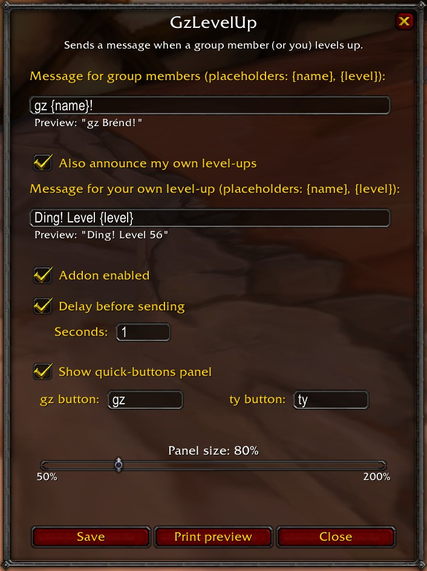

# GzLevelUp

**Never miss a "gz" again.** GzLevelUp automatically posts a congratulations
message to your party or raid chat the moment a group member levels up — so you
can keep questing, fighting, and looting without breaking your flow.

Lightweight, fully configurable, and built for **WoW Classic / Anniversary** realms.

<p align="center">
  
</p>

<p align="center">
  <a href="https://www.curseforge.com/wow/addons/gzlevelup">Download on CurseForge</a>
</p>

---

## Features

- **Automatic level-up congratulations** — posts your message to party chat the
  moment a group member gains a level (raid chat is opt-in).
- **Smart detection** — only fires on real level-ups, never when a member joins
  the group or comes into range.
- **Separate self message** — optionally announce your own "ding" with a
  different text (opt-in).
- **Pets and companions** (opt-in) — congratulate a hunter's or warlock's pet
  too, with its own message and an `{owner}` placeholder.
- **Customizable messages** with placeholders `{name}` and `{level}`.
- **Per-category delay** — each of the three announcement types has its own
  0–60 s pause before sending (`0` = immediately).
- **Movable quick-button panel** (opt-in) — a floating panel with two buttons
  (**gz** / **ty**) that post to your group with one click. Configurable button
  texts, remembered position, and a size slider (50–200 %).
- **Auto reply** (opt-in) — after *your own* level-up, wait for people to say
  "gz" and then thank them all in a single "ty", naming everyone.
- **Raid-safe** — raid chat is opt-in, so the addon stays quiet in a 40-man raid
  unless you allow it.
- **In-game config window** (`/gz`) — five tabs, live preview, auto-save, and it
  remembers where you dragged it.
- **Localization** — English by default, German included automatically on
  German clients.
- **Tiny footprint** — no dependencies, no background polling.

---

## Screenshots

<table>
  <tr>
    <td align="center" valign="top">
      <br>
      <sub>In-game config window (<code>/gz</code>)</sub>
    </td>
    <td align="center" valign="top">
      <br>
      <sub>Movable quick-buttons panel (gz / ty)</sub>
    </td>
  </tr>
</table>

---

## Installation

### CurseForge (recommended)
Install and auto-update via the
[CurseForge app](https://www.curseforge.com/wow/addons/gzlevelup) — search for
**GzLevelUp** or use the app's install button on the addon page.

### Manual
1. Download the latest release.
2. Copy the `GzLevelUp` folder into your WoW `Interface/AddOns/` directory:
   ```
   World of Warcraft/_classic_era_/Interface/AddOns/GzLevelUp/
   ```
3. Restart the game (or enable the addon on the character screen).

### From this repository
The `GzLevelUp/` folder in this repo is install-ready — copy it directly into
your `Interface/AddOns/` directory.

---

## Usage

Type **`/gz`** to open the configuration window. The addon also works out of the
box with sensible defaults.

### Slash commands

| Command | Description |
|---|---|
| `/gz` | Open / close the configuration window |
| `/gz on` \| `off` | Enable or disable the addon |
| `/gz msg <text>` | Set the message for group members |
| `/gz selfmsg <text>` | Set the message for your own level-up |
| `/gz self` | Toggle announcing your own level-up |
| `/gz petmsg <text>` | Set the message for a pet's level-up |
| `/gz group` | Toggle announcing group members |
| `/gz raid` | Toggle using raid chat (off by default) |
| `/gz reply` | Toggle the auto reply after your own level-up |
| `/gz pets` | Toggle announcing pets and companions |
| `/gz delay <sec>` | Set the delay for all three categories (`0` = immediately) |
| `/gz delay <group\|self\|pets> <sec>` | Set the delay for one category |
| `/gz panel` | Toggle the floating quick-buttons panel |
| `/gz scale <pct>` | Set the quick panel size in percent (50–200) |
| `/gz test` | Preview your current messages (nothing is sent) |

### Placeholders

In the three level-up messages:

- **`{name}`** → the name of whoever levelled up (player or pet)
- **`{level}`** → their new level
- **`{owner}`** → the pet's owner — only meaningful in the pet message

Example: `Gz {name}, welcome to level {level}!`
Pet example: `Gz {owner}'s {name}!`

In the auto-reply message:

- **`{names}`** → everyone who congratulated you, comma separated
- **`{name}`** → the first one
- **`{count}`** → how many there were

Example: `ty {names}!`

---

## Localization

The UI language follows your WoW client language. **English** is the default;
**German (deDE)** is included and used automatically on German clients. To add a
language, extend `GzLevelUp/Locale.lua` with a new `if GetLocale() == "xxXX"`
block.

---

## Project structure

```
.
├── GzLevelUp/            # the addon itself (install-ready)
│   ├── GzLevelUp.toc
│   ├── Locale.lua        # localization (enUS + deDE)
│   ├── GzLevelUp.lua     # core logic + config UI + quick panel
│   └── icon.tga          # icon for the in-game addon list
├── tests/                # test suite (not shipped with the addon)
│   ├── harness.lua       # stubbed WoW API
│   └── run.lua           # the tests
├── media/                # logo assets (not shipped with the addon)
├── CURSEFORGE.md         # CurseForge project description
├── LICENSE
└── README.md
```

---

## Tests

The suite loads the real addon against a stubbed WoW API, drives it through
events (`UNIT_LEVEL`, `CHAT_MSG_PARTY`, …) and asserts on what it would have
said in chat. No game client needed:

```bash
lua5.1 tests/run.lua
```

WoW Classic embeds Lua 5.1, so that is the version CI runs. Any Lua ≥ 5.1 works
locally. The suite exits non-zero on failure and gates both the `test` workflow
(every push) and the `release` workflow (tags).

---

## Building a release package

Zip the `GzLevelUp/` folder so it unpacks as `GzLevelUp/…`:

```bash
zip -r GzLevelUp.zip GzLevelUp
```

The `media/`, `tests/`, `CURSEFORGE.md`, and repository metadata are
intentionally left out of the addon package.

`GzLevelUp/icon.tga` is generated from `media/logo.png` and shows up next to the
addon in the in-game addon list. WoW reads only BLP and TGA — not PNG — so it
has to be a 64×64 uncompressed 32-bit TGA:

```bash
python3 -c "from PIL import Image; \
Image.open('media/logo.png').convert('RGBA').resize((64,64), Image.LANCZOS) \
.save('GzLevelUp/icon.tga', compression=None)"
```

---

## Contributing

Bug reports, suggestions, and translations are welcome — please open an issue or
pull request.

---

## License

Released under the [MIT License](LICENSE).

*Author: BrendTM*
